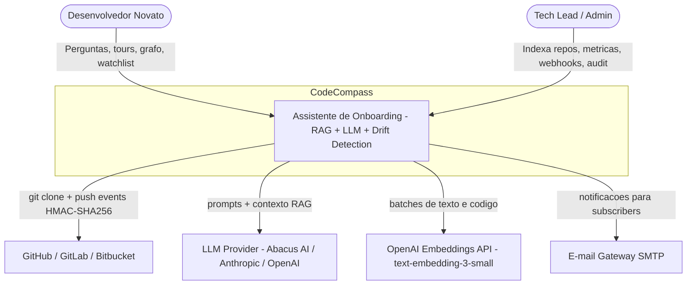
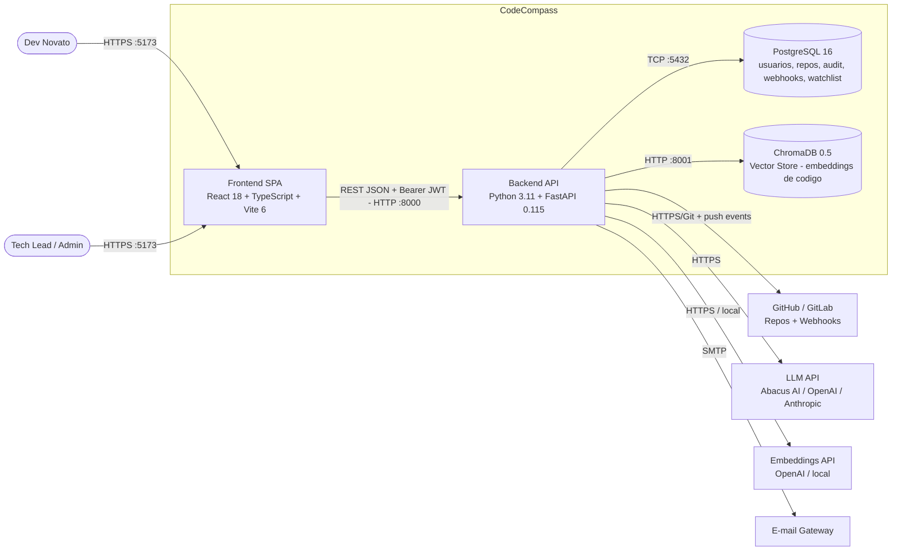

# Documento de Arquitetura — CodeCompass

**C4 Model — Níveis 1, 2 e 3**

## Versão e histórico

| Versão | Data       | Autor                          | Descrição                                                                          |
| ------ | ---------- | ------------------------------ | ---------------------------------------------------------------------------------- |
| 1.0    | 2026-05-10 | Victor Barros de Miranda Neves | Versão inicial — arquitetura hexagonal, C4 N1+N2                                   |
| 1.1    | 2026-05-22 | Victor Barros de Miranda Neves | Adição do N3 (componentes do RAG/LLM), atualização de tecnologias                  |
| 1.2    | 2026-06-08 | Victor Barros de Miranda Neves | Formalização no template C4 Model; inclusão de ADRs                                |
| 1.3    | 2026-06-15 | Victor Barros de Miranda Neves | Fase 4: drift arquitetural, audit log, webhooks HMAC, watchlist; ADR-007 e ADR-008 |

---

## Nível 1 — Contexto (Context Diagram)

> Visão de mais alto nível: quem são os usuários, com quais sistemas externos o CodeCompass interage, e onde a IA se encaixa nesse contexto.



**Descrição:**

- **Usuários:** Desenvolvedores novatos (usuário primário) e Tech Leads/admins (usuário secundário)
- **Sistemas externos:**
    - **GitHub/GitLab/Bitbucket:** fonte dos repositórios; CodeCompass acessa via HTTPS público. Também recebe push events via webhooks com verificação HMAC-SHA256
    - **LLM Provider (Abacus AI / Anthropic / OpenAI):** geração de linguagem natural; configurável via `LLM_PROVIDER` env var
    - **OpenAI Embeddings API:** geração de vetores semânticos para busca RAG; alternativa local com `sentence-transformers`
    - **E-mail Gateway:** envio de notificações quando módulos assinados mudam estruturalmente
- **Papel dos LLMs:** Central — toda resposta do chat, geração de tours, relatórios de qualidade e interpretação de drift arquitetural passam pelo LLM. O sistema sem LLM cai em modo fallback (template-based).

---

## Nível 2 — Contêineres (Container Diagram)

> As grandes partes do sistema: aplicações, bancos de dados, APIs e serviços de infraestrutura.



**Descrição de cada contêiner:**

| Contêiner         | Tecnologia                         | Porta | Responsabilidade                                                                                                                                                                                                                                            |
| ----------------- | ---------------------------------- | ----- | ----------------------------------------------------------------------------------------------------------------------------------------------------------------------------------------------------------------------------------------------------------- |
| **Frontend SPA**  | React 18 + TypeScript 5.8 + Vite 6 | :5173 | Interface com 16 abas: Repositório, Chat RAG, Tour, Grafo, Impacto, Busca, Hotspots, Branch, Gerar Docs, Dívida Técnica, Drift Arq., Watchlist, Histórico, Métricas, Operacional, Admin.                                                                    |
| **Backend API**   | Python 3.11 + FastAPI 0.115        | :8000 | 18 routers REST; RAG pipeline; hotspots; dívida técnica multidimensional + LLM; análise de branch com risk score; geração de docs via LLM; busca semântica; relatórios HTML; drift arquitetural; audit middleware; webhooks HMAC; watchlist + notificações. |
| **PostgreSQL 16** | PostgreSQL                         | :5432 | Persistência relacional: usuários, sessões, repos, commits, métricas, audit_log, webhooks, watchlist, snapshots do grafo, snapshots de tech-debt                                                                                                            |
| **ChromaDB 0.5**  | ChromaDB                           | :8001 | Vector store para embeddings de código; busca semântica por cosine similarity para o RAG                                                                                                                                                                    |

**Infraestrutura:** Todos os 4 contêineres são orquestrados pelo `docker-compose.yml` na raiz do repositório. O frontend consome apenas o backend (sem acesso direto a banco ou vector store).

---

## Nível 3 — Componentes (Component Diagram)

> Zoom no contêiner **Backend API** — os componentes internos organizados em Arquitetura Hexagonal.

```mermaid
flowchart LR
    subgraph HTTP["Controllers - HTTP Layer (18)"]
        auth_ctrl["auth_controller\nPOST /signup /signin /sessions"]
        repo_ctrl["repo_controller\nPOST/GET /repos"]
        chat_ctrl["chat_controller\nPOST /chat/ask"]
        tour_ctrl["tour_controller\nPOST/GET /tours"]
        graph_ctrl["graph_controller\nGET /graph /diff /interpret"]
        history_ctrl["history_controller\nGET /repos/history /why"]
        metrics_ctrl["metrics_controller\nGET/POST /repos/metrics"]
        hotspot_ctrl["hotspot_controller\nGET /repos/hotspots"]
        tech_debt_ctrl["tech_debt_controller\nGET/POST /repos/tech-debt"]
        branch_ctrl["branch_controller\nPOST /repos/analyze-branch"]
        search_ctrl["search_controller\nGET /repos/search"]
        doc_ctrl["doc_controller\nPOST /repos/generate-doc"]
        report_ctrl["report_controller\nGET /repos/report"]
        admin_ctrl["admin_controller\nGET/PATCH /admin/*"]
        watch_ctrl["watchlist_controller\nPOST/DELETE /repos/watch"]
        webhook_ctrl["webhook_controller\nHMAC-SHA256"]
        ops_ctrl["ops_controller\nGET /ops/liveness /readiness"]
        health_ctrl["health_controller\nGET /health"]
    end

    subgraph SVC["Services - Domain Layer (24+)"]
        auth_svc["auth_service\nbcrypt + JWT sessions"]
        token_svc["token_service\nJWT issue/decode"]
        plan_enforcer["plan_enforcer\nlimites de plano"]
        repo_svc["repo_service\ngit clone > chunk > embed > store"]
        chunk_svc["chunking_service\ntree-sitter 15 langs"]
        chat_svc["chat_service\nRAG pipeline"]
        embed_svc["embedding_service\nOpenAI / local"]
        retrieval_svc["retrieval_service\nbusca vetorial"]
        tour_svc["tour_service\nLLM walkthroughs"]
        graph_svc["graph_service\ngrafo de dependencias"]
        drift_svc["drift_service\ndiff de snapshots"]
        hist_svc["history_service\ncommits + LLM"]
        hotspot_svc["hotspot_service\nchurn x complexity score"]
        tech_debt_svc["tech_debt_service\nmultidimensional + LLM"]
        branch_svc["branch_analysis_service\nrisk score + LLM"]
        doc_svc["doc_generator_service\nMarkdown via LLM"]
        report_svc["report_service\nHTML report"]
        metrics_svc["metrics_aggregation_service\nKPIs de onboarding"]
        notif_svc["notification_service\ne-mail alerts"]
        analyzers["analyzers\nChurn/Complexity/Coupling"]
    end

    subgraph INFRA["Infrastructure - Adapters"]
        llm_client["llm_client\nAbacus/OpenAI/Anthropic"]
        chroma_adp["chroma_adapter\nHTTP ChromaDB"]
        pg_adp["postgres_adapter\npsycopg"]
        git_client["git_client\nGitPython"]
        audit_repo["audit_repository\naudit_log table"]
        watchlist_repo["watchlist_repository"]
        webhook_repo["webhook_repository\nHMAC secrets"]
        tech_debt_repo["tech_debt_repository\nsnapshots table"]
        user_repo["user_repository\nusers table"]
        email_gw["email_gateway\nSMTP"]
    end

    PG[("PostgreSQL 16")]
    CHROMA[("ChromaDB 0.5")]
    LLM_API(["LLM API"])
    EMBED_API(["Embeddings API"])
    GIT_REMOTE(["GitHub / Git Remote"])
    EMAIL_EXT(["E-mail SMTP"])

    auth_ctrl --> auth_svc
    repo_ctrl --> repo_svc
    chat_ctrl --> chat_svc
    tour_ctrl --> tour_svc
    graph_ctrl --> graph_svc
    graph_ctrl --> drift_svc
    history_ctrl --> hist_svc
    metrics_ctrl --> metrics_svc
    hotspot_ctrl --> hotspot_svc
    tech_debt_ctrl --> tech_debt_svc
    branch_ctrl --> branch_svc
    search_ctrl --> retrieval_svc
    doc_ctrl --> doc_svc
    report_ctrl --> report_svc
    admin_ctrl --> audit_repo
    watch_ctrl --> watchlist_repo
    webhook_ctrl --> webhook_repo
    webhook_ctrl --> repo_svc

    auth_svc --> token_svc
    auth_svc --> user_repo
    repo_svc --> chunk_svc
    repo_svc --> embed_svc
    repo_svc --> git_client
    repo_svc --> notif_svc
    chat_svc --> retrieval_svc
    chat_svc --> llm_client
    tour_svc --> analyzers
    tour_svc --> llm_client
    drift_svc --> graph_svc
    hist_svc --> git_client
    hist_svc --> llm_client
    hotspot_svc --> analyzers
    tech_debt_svc --> hotspot_svc
    tech_debt_svc --> tech_debt_repo
    tech_debt_svc --> llm_client
    branch_svc --> git_client
    branch_svc --> llm_client
    doc_svc --> llm_client
    doc_svc --> chroma_adp
    report_svc --> tech_debt_repo
    metrics_svc --> pg_adp
    notif_svc --> watchlist_repo
    notif_svc --> email_gw
    embed_svc --> chroma_adp
    retrieval_svc --> chroma_adp
    graph_svc --> pg_adp

    llm_client --> LLM_API
    embed_svc --> EMBED_API
    chroma_adp --> CHROMA
    pg_adp --> PG
    audit_repo --> PG
    watchlist_repo --> PG
    webhook_repo --> PG
    tech_debt_repo --> PG
    user_repo --> PG
    git_client --> GIT_REMOTE
    email_gw --> EMAIL_EXT
```



**Diagrama de fluxo — Indexação de Repositório:**

```
POST /api/repos/{url}
       │
       ▼
repo_controller
       │ background task
       ▼
repo_service.index_repository()
       │
       ├── git_client.clone_repository()          → clone local
       │
       ├── ingestion_service.collect_files()      → lista arquivos por extensão
       │       └── language_registry              → 15 linguagens suportadas
       │
       ├── chunking_service.chunk_file()          → tree-sitter AST → chunks
       │       └── Para cada arquivo:
       │           ├── parse com tree-sitter
       │           └── extrai funções/classes/blocos com metadados
       │
       ├── embedding_service.embed_texts()        → vetores float[]
       │       ├── provider=openai → OpenAI API (batch, paralelo, ~12s)
       │       └── provider=local → sentence-transformers (~220s)
       │
       ├── chroma_adapter.store_embeddings()      → ChromaDB
       │       └── PostgresAdapter.update_status("completed")
       │
       ├── dependency_graph_service.save_snapshot() → snapshot do grafo (PostgreSQL)
       │
       └── notification_service.notify_on_reindex()
               └── detecta módulos alterados → e-mail para watchlist subscribers
```

**Diagrama de fluxo — Chat RAG:**

```
POST /api/chat/ask
   {"question": "O que faz o módulo de auth?"}
       │
       ▼
chat_controller
       │
       ▼
chat_service.ask()
       │
       ├── retrieval_service.search()
       │       └── embedding_service.embed_texts([question])
       │               └── chroma_adapter.search(vector, top_k=5)
       │                       └── retorna 5 chunks mais similares
       │
       └── llm_client.generate_answer(question, context_chunks)
               ├── _build_context() → formata 5 chunks com file_path + start_line
               ├── _build_user_prompt() → question + context
               └── provider.call(SYSTEM_PROMPT, user_prompt)
                       └── retorna resposta em linguagem natural
```

**Diagrama de fluxo — Drift Arquitetural:**

```
POST /api/repos/{id}/graph/diff/interpret
   {"snapshot_a": "uuid-a", "snapshot_b": "uuid-b"}
       │
       ▼
dependency_graph_controller
       │
       ▼
architecture_drift_service.compare(snapshot_a, snapshot_b)
       │
       ├── Lê snapshots do PostgreSQL (nodes[], edges[])
       ├── set(nodes_a) vs set(nodes_b) → added_nodes, removed_nodes
       ├── set(edges_a) vs set(edges_b) → added_edges, removed_edges
       └── drift_score = len(changed) / len(total) * 100
       │
       ▼
llm_client.generate_answer(drift_prompt, [diff_chunk])
       └── Retorna interpretação em português
```

**Diagrama de fluxo — Webhook GitHub:**

```
POST /api/webhooks/github/{webhook_id}
   X-Hub-Signature-256: sha256=<hmac>
   body: { "ref": "refs/heads/main", ... }
       │
       ▼
webhook_controller
       │
       ├── webhook_repository.get(webhook_id) → record com secret
       │
       ├── hmac.new(secret.encode(), body, sha256).hexdigest()
       │   hmac.compare_digest(expected, received)   ← timing-safe
       │   → 401 se inválido
       │
       ├── Filtra: evento "push" na branch configurada
       │
       ├── webhook_repository.touch(webhook_id) → last_triggered_at
       │
       └── repo_service.trigger_reindex(repository_id)
               └── BackgroundTasks → pipeline de indexação completo
```

---

## Decisões Arquiteturais (ADRs)

### ADR-001: Arquitetura Hexagonal (Ports & Adapters)

- **Contexto:** O sistema precisa integrar múltiplos providers externos (LLM, embeddings, banco de dados) que podem mudar ao longo do semestre. Testes precisam rodar sem chamar APIs externas reais.
- **Decisão:** Aplicar Arquitetura Hexagonal com `ports.py` definindo interfaces `Protocol` e adapters em `infrastructure/` implementando cada interface.
- **Alternativas consideradas:** Arquitetura em camadas tradicional (simples mas difícil de testar); Clean Architecture completa (mais rigorosa mas overhead excessivo para equipe de 6).
- **Consequências:** Todos os services dependem de abstrações, não de implementações concretas. Testes unitários usam mocks das ports sem dependência de Docker. Swap de provider (ex: trocar ChromaDB por Pinecone) requer apenas novo adapter.

### ADR-002: ChromaDB como Vector Store

- **Contexto:** O RAG pipeline precisa de busca semântica eficiente sobre embeddings de código. Necessidade de rodar local em desenvolvimento sem custo.
- **Decisão:** ChromaDB 0.5 em container Docker próprio (porta 8001).
- **Alternativas consideradas:** Pinecone (cloud, custo, latência), pgvector (PostgreSQL + extensão — mais simples mas menor performance para grandes volumes), FAISS (in-memory, sem persistência).
- **Consequências:** Zero custo em desenvolvimento, persistência automática em volume Docker, API HTTP simples. Trade-off: não escala horizontalmente para >1M embeddings sem sharding manual.

### ADR-003: Multi-Provider LLM com Configuração por Env Var

- **Contexto:** A equipe usa Abacus AI (acesso gratuito para estudantes), mas o sistema deve funcionar com OpenAI e Anthropic para generalidade. O provider pode mudar sem redeployment.
- **Decisão:** `LlmClient` com factory pattern interno: `LLM_PROVIDER` env var seleciona Abacus AI, OpenAI ou Anthropic. Fallback template-based quando sem chave.
- **Alternativas consideradas:** Usar apenas OpenAI (mais simples mas custo em produção); LiteLLM (abstração pronta mas dependência adicional pesada).
- **Consequências:** Flexibilidade de provider sem mudança de código. PROMPT-001 é o mesmo para todos os providers. Risco: cada provider tem nuances de temperatura/max_tokens — mitigado com configuração unificada em `settings.py`.

### ADR-004: Embeddings Dual-Mode (Local vs OpenAI)

- **Contexto:** Embeddings locais com `all-MiniLM-L6-v2` levam ~220s para repositórios médios (>5k arquivos). OpenAI `text-embedding-3-small` leva ~12s com paralelismo mas requer chave paga.
- **Decisão:** `EmbeddingService` suporta dois modos: `EMBEDDING_PROVIDER=local` (padrão, sem custo) e `EMBEDDING_PROVIDER=openai` (produção, 18.7x mais rápido). Mesmo adapter para ambos.
- **Alternativas consideradas:** Apenas local (lento demais para repositórios grandes), apenas OpenAI (custo e dependência de API key obrigatória).
- **Consequências:** Desenvolvimento e CI rodam local. Demonstrações e produção usam OpenAI. `ThreadPoolExecutor` com `EMBEDDING_MAX_WORKERS=4` para paralelismo nos batches OpenAI.

### ADR-005: React SPA (Vite) em vez de Next.js

- **Contexto:** PROPOSTA_v1.md especificava Next.js como frontend. Durante a fase de implementação, a equipe avaliou as necessidades reais da interface.
- **Decisão:** React 18 + Vite 6 como SPA simples, sem SSR.
- **Alternativas consideradas:** Next.js (SSR, file-based routing — overhead desnecessário para uma SPA administrativa); Vue.js (equipe sem experiência prévia).
- **Consequências:** Build mais rápido, configuração mais simples, zero necessidade de SSR (a aplicação não tem SEO requirements). Tailwind CSS via CDN Play elimina a necessidade de PostCSS/build pipeline para estilos.

### ADR-006: tree-sitter para Chunking Multi-Linguagem

- **Contexto:** O sistema precisa fazer chunking de código de forma semântica (por função/classe, não por número fixo de linhas) para melhorar qualidade do RAG. Precisava suportar além de Python (requisito original do MVP).
- **Decisão:** tree-sitter com 15 linguagens: Python, JavaScript, TypeScript, Java, Go, Rust, C, C++, C#, Ruby, PHP, Kotlin, Scala, Bash, Swift (fallback texto).
- **Alternativas consideradas:** Chunking por linhas fixas (rápido mas corta funções ao meio, prejudicando o contexto do RAG); ast Python puro (apenas Python); langchain `RecursiveCharacterTextSplitter` (mais simples mas sem consciência de AST).
- **Consequências:** Qualidade de RAG superior — chunks sempre terminam em funções/classes completas. Custo: build mais lento e ~150MB de dependências tree-sitter. Permite indexar projetos polyglot (Java + TypeScript, por exemplo).

### ADR-007: Audit Log como Middleware Cross-Cutting (não lógica em controllers)

- **Contexto:** Fase 4 requer rastreabilidade de todas as ações de mutação (POST/PATCH/DELETE). Adicionar lógica de auditoria em cada controller seria repetitivo e propenso a omissões.
- **Decisão:** Implementar `audit_middleware` em `main.py` como middleware ASGI. Após cada resposta bem-sucedida de método mutativo (status < 400), registrar automaticamente user_id, e-mail, ação, resource_type e IP no `AuditRepository`.
- **Alternativas consideradas:** Decoradores por controller (trabalhoso, esquecimento fácil); eventos de domínio (overhead para o escopo do projeto); triggers PostgreSQL (acoplamento excessivo com a infra).
- **Consequências:** Auditoria é garantida para 100% das mutações sem nenhum código adicional nos controllers. Exclusões explícitas (`/api/chat/ask`, `/api/webhooks`) evitam volume excessivo. Trade-off: o middleware precisa parsear o JWT em um caminho fora da injeção de dependências padrão.

### ADR-008: HMAC-SHA256 para Autenticação de Webhooks

- **Contexto:** Fase 4 precisa receber push events do GitHub de forma segura. Qualquer agente externo poderia fazer POST para o endpoint de webhook se não houvesse verificação.
- **Decisão:** Cada webhook tem um segredo gerado com `secrets.token_hex(32)` (256 bits). O receiver verifica a assinatura `X-Hub-Signature-256` com `hmac.compare_digest()` (comparação timing-safe).
- **Alternativas consideradas:** Token Bearer simples (mais fácil de implementar, mas vulnerável a replay attacks sem timestamp check); mTLS (muito complexo para o escopo); IP whitelist (GitHub muda IPs).
- **Consequências:** Compatível com o padrão do GitHub nativo. `hmac.compare_digest()` evita timing attacks (Python `==` é vulnerável). O segredo é retornado **apenas na criação** e armazenado em hash no banco — impossível de recuperar depois, forçando rotação se perdido.

---

## Visão de Segurança

| Camada                | Controle                 | Implementação                                                                                              |
| --------------------- | ------------------------ | ---------------------------------------------------------------------------------------------------------- |
| **Credenciais**       | Sem hardcoding           | Todas as chaves em env vars; `POSTGRES_PASSWORD` e `ADMIN_PASSWORD` obrigatórios (`${VAR:?required}`)      |
| **Senhas de usuário** | Hash seguro              | bcrypt via `passlib` em `auth_service.py`                                                                  |
| **Autenticação**      | JWT Bearer global        | `useAuthStore.getState().token` injetado automaticamente em todas as chamadas HTTP via `bearerHeaders()`   |
| **Autorização admin** | Verificação de role      | Endpoints `/api/admin/*` verificam `user.role == "admin"` via `require_auth` + role check                  |
| **Webhooks**          | HMAC-SHA256 timing-safe  | `hmac.compare_digest()` + segredo `secrets.token_hex(32)` retornado apenas na criação                      |
| **Repositórios**      | Validação de URL         | `git_client.py` valida formato antes do clone; `ALLOW_LOCAL_REPOS=false` bloqueia paths locais em produção |
| **Segredos**          | Gitignore                | `.env` na linha 69 do `.gitignore`; `.env.example` sem valores reais no repositório                        |
| **Containers**        | Isolamento de rede       | Docker Compose com rede bridge; PostgreSQL e ChromaDB não expostos externamente                            |
| **Auditoria**         | Rastreabilidade completa | Audit middleware registra toda mutação com user_id, IP, recurso e timestamp                                |

---

## Índice de Documentos

| Documento                                    | Descrição                                            |
| -------------------------------------------- | ---------------------------------------------------- |
| [README.md](README.md)                       | Visão geral, stack, features por fase, como executar |
| [COMO_FUNCIONA.md](COMO_FUNCIONA.md)         | Arquitetura narrativa + fluxos detalhados            |
| [COMO_RODAR.md](COMO_RODAR.md)               | Setup passo a passo do zero                          |
| [CATALOGO_PROMPTS.md](CATALOGO_PROMPTS.md)   | Todos os 9 prompts da aplicação documentados         |
| [C4_MODEL.md](C4_MODEL.md)                   | Este documento — C4 Model completo                   |
| [ARCHITECTURE.md](ARCHITECTURE.md)           | Arquitetura hexagonal, SOLID, DI patterns            |
| [PROPOSTA_v1.md](PROPOSTA_v1.md)             | Proposta inicial, problema e solução                 |
| [WORKFLOW_DOCUMENT.md](WORKFLOW_DOCUMENT.md) | Registro de uso de IA e economicidade                |
