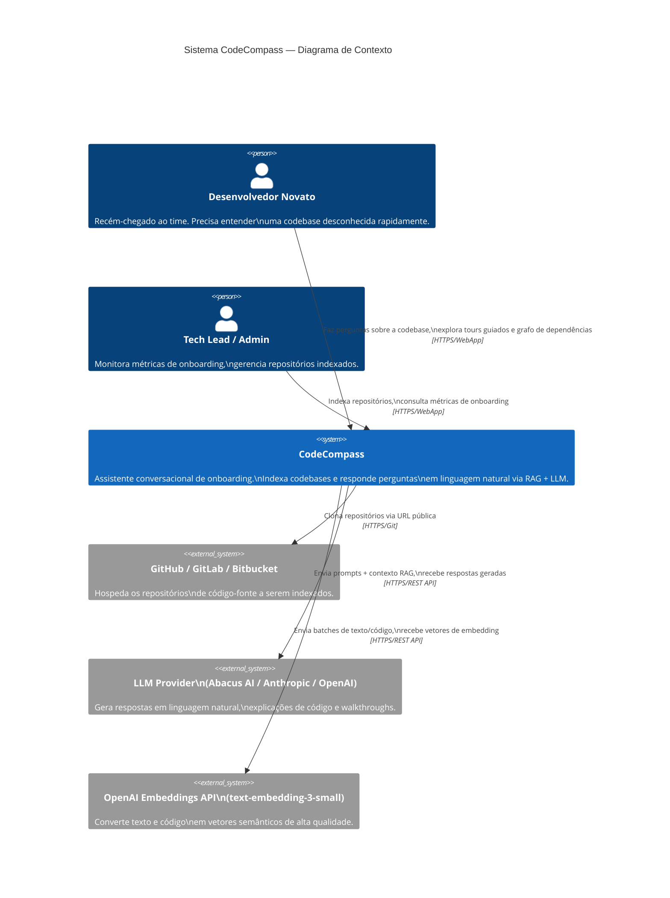

# Documento de Arquitetura — CodeCompass

**C4 Model — Níveis 1, 2 e 3**

## Versão e histórico

| Versão | Data       | Autor                          | Descrição                                                         |
| ------ | ---------- | ------------------------------ | ----------------------------------------------------------------- |
| 1.0    | 2026-05-10 | Victor Barros de Miranda Neves | Versão inicial — arquitetura hexagonal, C4 N1+N2                  |
| 1.1    | 2026-05-22 | Victor Barros de Miranda Neves | Adição do N3 (componentes do RAG/LLM), atualização de tecnologias |
| 1.2    | 2026-06-08 | Victor Barros de Miranda Neves | Formalização no template C4 Model; inclusão de ADRs               |

---

## Nível 1 — Contexto (Context Diagram)

> Visão de mais alto nível: quem são os usuários, com quais sistemas externos o CodeCompass interage, e onde a IA se encaixa nesse contexto.



**Descrição:**

- **Usuários:** Desenvolvedores novatos (usuário primário) e Tech Leads/admins (usuário secundário)
- **Sistemas externos:**
    - **GitHub/GitLab/Bitbucket:** fonte dos repositórios; CodeCompass acessa via HTTPS público (sem autenticação no MVP)
    - **LLM Provider (Abacus AI / Anthropic / OpenAI):** geração de linguagem natural; configurável via `LLM_PROVIDER` env var
    - **OpenAI Embeddings API:** geração de vetores semânticos para busca RAG; alternativa local com `sentence-transformers`
- **Papel dos LLMs:** Central — toda resposta do chat, geração de tours e relatórios de qualidade passam pelo LLM. O sistema sem LLM cai em modo fallback (template-based).

---

## Nível 2 — Contêineres (Container Diagram)

> As grandes partes do sistema: aplicações, bancos de dados, APIs e serviços de infraestrutura.

```mermaid
C4Container
    title Sistema CodeCompass — Diagrama de Contêineres

    Person(dev_novo, "Desenvolvedor Novato")
    Person(tech_lead, "Tech Lead / Admin")

    System_Boundary(codecompass, "CodeCompass") {

        Container(frontend, "Frontend SPA", "React 18 + TypeScript 5.8\nVite 6 + Tailwind CSS",
            "Interface web com 7 abas:\nChat RAG, Tour Guiado,\nGrafo de Dependências,\nHistórico de Commits,\nMétricas, Repositório, Autenticação.\nDark mode + sidebar colapsável.")

        Container(backend, "Backend API", "Python 3.11 + FastAPI 0.115\nArquitetura Hexagonal (Ports & Adapters)",
            "9 controllers REST.\nOrquestra RAG pipeline,\nindexação de repositórios,\ngeração de tours e tours guiados,\nautentica usuários, coleta métricas.")

        ContainerDb(postgres, "PostgreSQL 16", "Banco de dados relacional",
            "Armazena: usuários, sessões de onboarding,\nmetadados de repositórios (status, URL, stats),\nhistórico de commits classificados,\nmétricas de uso e feedback.")

        ContainerDb(chroma, "ChromaDB 0.5", "Vector Store",
            "Armazena embeddings de código-fonte\nindexado para busca semântica (RAG).\nColeção por repositório.\nDistância: cosine similarity.")
    }

    System_Ext(github, "GitHub / GitLab", "Repositório remoto")
    System_Ext(llm_api, "LLM API\n(Abacus AI / Anthropic / OpenAI)")
    System_Ext(embed_api, "OpenAI Embeddings API\nou sentence-transformers (local)")

    Rel(dev_novo, frontend, "Acessa via navegador", "HTTPS :5173")
    Rel(tech_lead, frontend, "Acessa via navegador", "HTTPS :5173")
    Rel(frontend, backend, "Requisições REST (JSON)", "HTTP :8000")
    Rel(backend, postgres, "Lê/escreve metadados,\nusuários e histórico", "PostgreSQL :5432")
    Rel(backend, chroma, "Armazena e consulta\nvetores de código", "HTTP :8001")
    Rel(backend, github, "Clona repositórios\n(git clone)", "HTTPS/Git")
    Rel(backend, llm_api, "Envia prompts + contexto RAG\nrecebe respostas geradas", "HTTPS")
    Rel(backend, embed_api, "Envia texto/código em batch\nrecebe vetores float[]", "HTTPS / local")
```

**Descrição de cada contêiner:**

| Contêiner         | Tecnologia                         | Porta | Responsabilidade                                                                                               |
| ----------------- | ---------------------------------- | ----- | -------------------------------------------------------------------------------------------------------------- |
| **Frontend SPA**  | React 18 + TypeScript 5.8 + Vite 6 | :5173 | Interface de usuário com 7 abas: Chat RAG, Tour, Grafo de Dependências, Histórico, Métricas, Repositório, Auth |
| **Backend API**   | Python 3.11 + FastAPI 0.115        | :8000 | API REST com 9 routers; orquestra todo o pipeline de indexação, RAG, autenticação e métricas                   |
| **PostgreSQL 16** | PostgreSQL                         | :5432 | Persistência relacional: usuários, sessões, metadados de repos, histórico de commits classificados, métricas   |
| **ChromaDB 0.5**  | ChromaDB                           | :8001 | Vector store para os embeddings de código; busca semântica por cosine similarity para o RAG                    |

**Infraestrutura:**

Todos os 4 contêineres são orquestrados pelo `docker-compose.yml` na raiz do repositório. O frontend consome apenas o backend (sem acesso direto a banco ou vector store).

---

## Nível 3 — Componentes (Component Diagram)

> Zoom no contêiner **Backend API** — os componentes internos organizados em Arquitetura Hexagonal.

```mermaid
C4Component
    title Backend API — Diagrama de Componentes (Arquitetura Hexagonal)

    Container_Boundary(backend, "Backend API — FastAPI") {

        Component(main, "main.py\n(Entry Point)", "FastAPI app factory",
            "Registra routers, configura CORS,\nseed do admin, background tasks.")

        Boundary(controllers, "Controllers (HTTP Layer)") {
            Component(auth_ctrl, "auth_controller", "FastAPI Router", "POST /signup, /signin, /sessions")
            Component(repo_ctrl, "repo_controller", "FastAPI Router", "POST/GET /repos — indexação e status")
            Component(chat_ctrl, "chat_controller", "FastAPI Router", "POST /chat/{repo_id}")
            Component(tour_ctrl, "tour_controller", "FastAPI Router", "POST/GET /tours/{repo_id}")
            Component(graph_ctrl, "dependency_graph_controller", "FastAPI Router", "GET /graph/{repo_id}")
            Component(hist_ctrl, "history_controller", "FastAPI Router", "GET /history/{repo_id}/why")
            Component(metrics_ctrl, "metrics_controller", "FastAPI Router", "GET/POST /metrics/{repo_id}")
            Component(ops_ctrl, "ops_controller", "FastAPI Router", "GET /ops/liveness, /readiness")
            Component(health_ctrl, "health_controller", "FastAPI Router", "GET /health")
        }

        Boundary(services, "Services (Domain Layer)") {
            Component(auth_svc, "auth_service", "Python class", "Signup, signin, hash de senha,\ngestão de sessões de onboarding")
            Component(repo_svc, "repo_service", "Python class", "Orquestra pipeline de indexação:\ngit clone → chunk → embed → store")
            Component(chat_svc, "chat_service", "Python class", "RAG: busca semântica + chamada LLM")
            Component(embed_svc, "embedding_service", "Python class", "Gera embeddings local (sentence-transformers)\nou OpenAI (text-embedding-3-small)")
            Component(retrieval_svc, "retrieval_service", "Python class", "Busca semântica no ChromaDB")
            Component(chunk_svc, "chunking_service", "Python class", "Divide código em chunks via tree-sitter\n(15 linguagens)")
            Component(tour_svc, "tour_service", "Python class", "Score módulos (complexidade × churn × acoplamento)\n+ geração de walkthroughs via LLM")
            Component(graph_svc, "dependency_graph_service", "Python class", "Analisa imports, constrói grafo,\ncalcula métricas de centralidade")
            Component(hist_svc, "history_orchestration_service", "Python class", "Ingere commits, classifica categorias,\norquestra timeline e Why explanations")
            Component(metrics_svc, "metrics_aggregation_service", "Python class", "Agrega KPIs de onboarding,\ngera relatório de qualidade")
            Component(analyzers, "analyzers\n(ChurnAnalyzer, ComplexityAnalyzer\nCouplingAnalyzer)", "Python classes", "Métricas de código: complexidade ciclomática\n(radon), churn (git log), acoplamento (AST imports)")
        }

        Boundary(ports, "Ports (Interfaces — Dependency Inversion)") {
            Component(ports_file, "ports.py", "Python Protocol classes",
                "LLMPort, VectorStorePort,\nRepositoryMetadataPort, GitClientPort,\nTourRepositoryPort, DecisionRepositoryPort")
        }

        Boundary(infra, "Infrastructure (Adapters — Implementations)") {
            Component(llm_client, "llm_client\n(LlmClient)", "Python class",
                "Implementa LLMPort.\nSuporta Abacus AI, Anthropic, OpenAI.\nFallback template-based sem chave.")
            Component(chroma_adapter, "chroma_adapter\n(ChromaAdapter)", "Python class",
                "Implementa VectorStorePort.\nInterface com ChromaDB via cliente HTTP.")
            Component(postgres_adapter, "postgres_adapter\n(PostgresAdapter)", "Python class",
                "Implementa RepositoryMetadataPort.\npsycopg2 com connection pool.")
            Component(git_client, "git_client\n(GitClient)", "Python class",
                "Implementa GitClientPort.\nGitPython + subprocess para git log.")
            Component(settings, "settings.py\n(Settings)", "Pydantic BaseSettings",
                "Todas as variáveis de ambiente.\nValidação automática no startup.")
        }

        Component(di, "dependencies.py\n(DI Container)", "FastAPI Depends",
            "Instancia e injeta todos os serviços\ne adaptadores nos controllers.")
    }

    ContainerDb(postgres, "PostgreSQL 16", "", "")
    ContainerDb(chroma, "ChromaDB 0.5", "", "")
    System_Ext(llm_api, "LLM API")
    System_Ext(embed_api, "Embeddings API")
    System_Ext(git_remote, "GitHub / Git Remote")

    Rel(auth_ctrl, auth_svc, "chama")
    Rel(repo_ctrl, repo_svc, "chama")
    Rel(chat_ctrl, chat_svc, "chama")
    Rel(tour_ctrl, tour_svc, "chama")
    Rel(graph_ctrl, graph_svc, "chama")
    Rel(hist_ctrl, hist_svc, "chama")
    Rel(metrics_ctrl, metrics_svc, "chama")

    Rel(repo_svc, chunk_svc, "usa")
    Rel(repo_svc, embed_svc, "usa")
    Rel(repo_svc, git_client, "via GitClientPort")
    Rel(chat_svc, retrieval_svc, "busca chunks")
    Rel(chat_svc, llm_client, "via LLMPort")
    Rel(embed_svc, chroma_adapter, "via VectorStorePort")
    Rel(tour_svc, analyzers, "usa para scoring")
    Rel(tour_svc, llm_client, "via LLMPort")
    Rel(hist_svc, git_client, "via GitClientPort")
    Rel(hist_svc, llm_client, "via LLMPort")

    Rel(llm_client, llm_api, "HTTPS")
    Rel(embed_svc, embed_api, "HTTPS / local")
    Rel(chroma_adapter, chroma, "HTTP :8001")
    Rel(postgres_adapter, postgres, "TCP :5432")
    Rel(git_client, git_remote, "HTTPS/Git")
    Rel(di, ports_file, "usa interfaces para injeção")
```

**Diagrama de fluxo — Indexação de Repositório:**

```
POST /api/repos/{url}
       │
       ▼
repo_controller
       │ background task
       ▼
repo_service.index_repository()
       │
       ├── git_client.clone_repository()          → clone local
       │
       ├── ingestion_service.collect_files()      → lista arquivos por extensão
       │       └── language_registry              → 15 linguagens suportadas
       │
       ├── chunking_service.chunk_file()          → tree-sitter AST → chunks
       │       └── Para cada arquivo:
       │           ├── parse com tree-sitter
       │           └── extrai funções/classes/blocos com metadados
       │
       ├── embedding_service.embed_texts()        → vetores float[]
       │       ├── provider=openai → OpenAI API (batch, paralelo, ~12s)
       │       └── provider=local → sentence-transformers (~220s)
       │
       └── chroma_adapter.store_embeddings()      → ChromaDB
               └── PostgresAdapter.update_status("completed")
```

**Diagrama de fluxo — Chat RAG:**

```
POST /api/chat/{repo_id}
   {"question": "O que faz o módulo de auth?"}
       │
       ▼
chat_controller
       │
       ▼
chat_service.ask()
       │
       ├── retrieval_service.search()
       │       └── embedding_service.embed_texts([question])
       │               └── chroma_adapter.search(vector, top_k=5)
       │                       └── retorna 5 chunks mais similares
       │
       └── llm_client.generate_answer(question, context_chunks)
               ├── _build_context() → formata 5 chunks com file_path + start_line
               ├── _build_user_prompt() → question + context
               └── provider.call(SYSTEM_PROMPT, user_prompt)
                       └── retorna resposta em linguagem natural
```

---

## Decisões Arquiteturais (ADRs)

### ADR-001: Arquitetura Hexagonal (Ports & Adapters)

- **Contexto:** O sistema precisa integrar múltiplos providers externos (LLM, embeddings, banco de dados) que podem mudar ao longo do semestre. Tests precisam rodar sem chamar APIs externas reais.
- **Decisão:** Aplicar Arquitetura Hexagonal com `ports.py` definindo interfaces `Protocol` e adapters em `infrastructure/` implementando cada interface.
- **Alternativas consideradas:** Arquitetura em camadas tradicional (simples mas difícil de testar); Clean Architecture completa (mais rigorosa mas overhead excessivo para equipe de 6).
- **Consequências:** Todos os services dependem de abstrações, não de implementações concretas. Testes unitários usam mocks das ports sem dependência de Docker. Swap de provider (ex: trocar ChromaDB por Pinecone) requer apenas novo adapter.

### ADR-002: ChromaDB como Vector Store

- **Contexto:** O RAG pipeline precisa de busca semântica eficiente sobre embeddings de código. Necessidade de rodar local em desenvolvimento sem custo.
- **Decisão:** ChromaDB 0.5 em container Docker próprio (porta 8001).
- **Alternativas consideradas:** Pinecone (cloud, custo, latência), pgvector (PostgreSQL + extensão — mais simples mas menor performance para grandes volumes), FAISS (in-memory, sem persistência).
- **Consequências:** Zero custo em desenvolvimento, persistência automática em volume Docker, API HTTP simples. Trade-off: não escala horizontalmente para >1M embeddings sem sharding manual.

### ADR-003: Multi-Provider LLM com Configuração por Env Var

- **Contexto:** A equipe usa Abacus AI (acesso gratuito para estudantes), mas o sistema deve funcionar com OpenAI e Anthropic para generalidade. O provider pode mudar sem redeployment.
- **Decisão:** `LlmClient` com factory pattern interno: `LLM_PROVIDER` env var seleciona Abacus AI, OpenAI ou Anthropic. Fallback template-based quando sem chave.
- **Alternativas consideradas:** Usar apenas OpenAI (mais simples mas custo em produção); LiteLLM (abstração pronta mas dependência adicional pesada).
- **Consequências:** Flexibilidade de provider sem mudança de código. PROMPT-001 é o mesmo para todos os providers. Risco: cada provider tem nuances de temperatura/max_tokens — mitigado com configuração unificada em `settings.py`.

### ADR-004: Embeddings Dual-Mode (Local vs OpenAI)

- **Contexto:** Embeddings locais com `all-MiniLM-L6-v2` levam ~220s para repositórios médios (>5k arquivos). OpenAI `text-embedding-3-small` leva ~12s com paralelismo mas requer chave paga.
- **Decisão:** `EmbeddingService` suporta dois modes: `EMBEDDING_PROVIDER=local` (padrão, sem custo) e `EMBEDDING_PROVIDER=openai` (produção, 18.7x mais rápido). Mesmo adapter para ambos.
- **Alternativas consideradas:** Apenas local (lento demais para repositórios grandes), apenas OpenAI (custo e dependência de API key obrigatória).
- **Consequências:** Desenvolvimento e CI rodam local. Demonstrações e produção usam OpenAI. ThreadPoolExecutor com `EMBEDDING_MAX_WORKERS=4` para paralelismo nos batches OpenAI.

### ADR-005: React SPA (Vite) em vez de Next.js

- **Contexto:** PROPOSTA_v1.md especificava Next.js como frontend. Durante a fase de implementação, a equipe avaliou as necessidades reais da interface.
- **Decisão:** React 18 + Vite 6 como SPA simples, sem SSR.
- **Alternativas consideradas:** Next.js (SSR, file-based routing — overhead desnecessário para uma SPA administrativa); Vue.js (equipe sem experiência prévia).
- **Consequências:** Build mais rápido, configuração mais simples, zero necessidade de SSR (a aplicação não tem SEO requirements). Tailwind CSS via CDN Play elimina a necessidade de PostCSS/build pipeline para estilos.

### ADR-006: tree-sitter para Chunking Multi-Linguagem

- **Contexto:** O sistema precisa fazer chunking de código de forma semântica (por função/classe, não por número fixo de linhas) para melhorar qualidade do RAG. Precisava suportar além de Python (requisito original do MVP).
- **Decisão:** tree-sitter com 15 linguagens: Python, JavaScript, TypeScript, Java, Go, Rust, C, C++, C#, Ruby, PHP, Kotlin, Scala, Bash, Swift (fallback texto).
- **Alternativas consideradas:** Chunking por linhas fixas (rápido mas corta funções ao meio, prejudicando o contexto do RAG); ast Python puro (apenas Python); langchain `RecursiveCharacterTextSplitter` (mais simples mas sem consciência de AST).
- **Consequências:** Qualidade de RAG superior — chunks sempre terminam em funções/classes completas. Custo: build mais lento e ~150MB de dependências tree-sitter. Permite indexar projetos polyglot (Java + TypeScript, por exemplo).

---

## Visão de Segurança

| Camada                | Controle           | Implementação                                                                                              |
| --------------------- | ------------------ | ---------------------------------------------------------------------------------------------------------- |
| **Credenciais**       | Sem hardcoding     | Todas as chaves em env vars; `POSTGRES_PASSWORD` e `ADMIN_PASSWORD` obrigatórios (`${VAR:?required}`)      |
| **Senhas de usuário** | Hash seguro        | bcrypt via `passlib` em `auth_service.py`                                                                  |
| **Autenticação**      | Token de sessão    | UUID v4 gerado no signup/signin, armazenado no PostgreSQL                                                  |
| **Repositórios**      | Validação de URL   | `git_client.py` valida formato antes do clone; `ALLOW_LOCAL_REPOS=false` bloqueia paths locais em produção |
| **Segredos**          | Gitignore          | `.env` na linha 69 do `.gitignore`; `.env.example` sem valores reais no repositório                        |
| **Containers**        | Isolamento de rede | Docker Compose com rede bridge; PostgreSQL e ChromaDB não expostos externamente                            |

---

## Índice de Documentos

| Documento                                       | Descrição                                  |
| ----------------------------------------------- | ------------------------------------------ |
| [README.md](../README.md)                       | Visão geral, stack, como executar          |
| [COMO_FUNCIONA.md](../COMO_FUNCIONA.md)         | Arquitetura narrativa + fluxos detalhados  |
| [COMO_RODAR.md](../COMO_RODAR.md)               | Setup passo a passo do zero                |
| [CATALOGO_PROMPTS.md](../CATALOGO_PROMPTS.md)   | Todos os prompts da aplicação documentados |
| [PROPOSTA_v1.md](../PROPOSTA_v1.md)             | Proposta inicial, problema e solução       |
| [WORKFLOW_DOCUMENT.md](../WORKFLOW_DOCUMENT.md) | Registro de uso de IA e economicidade      |
